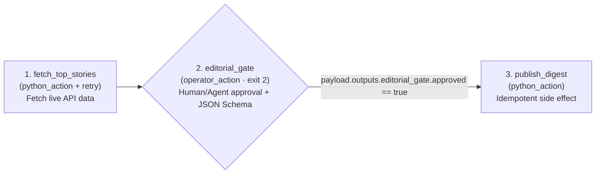
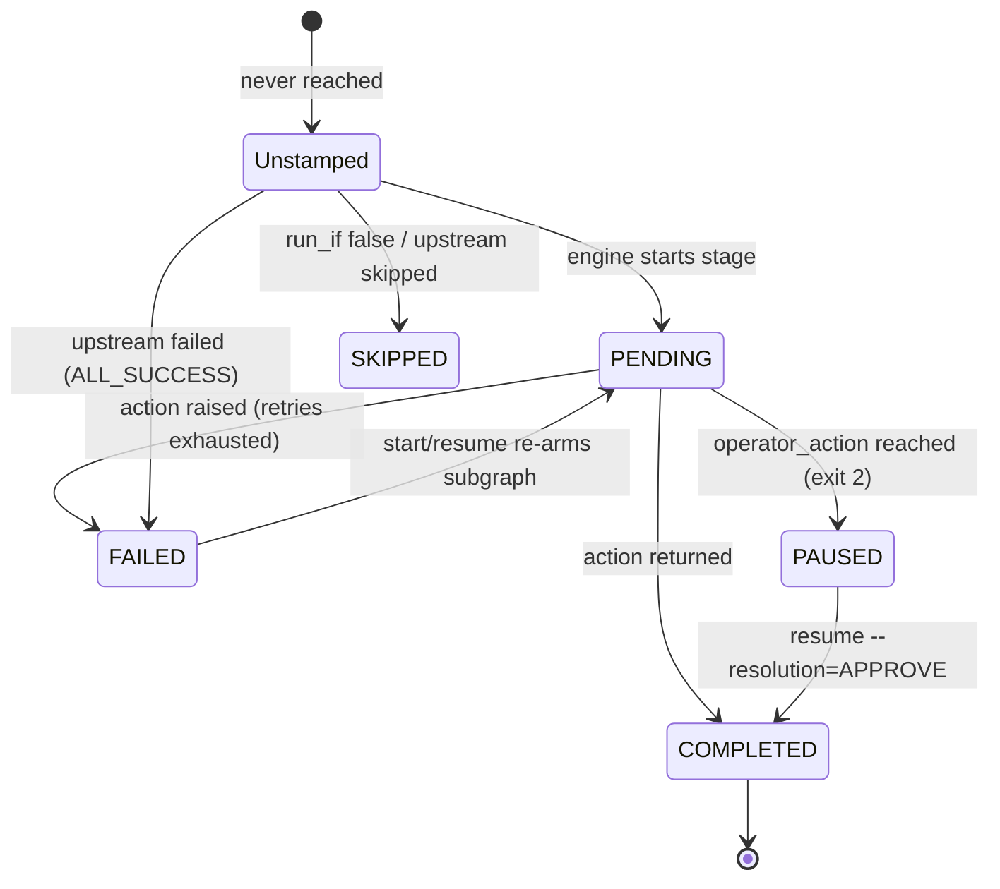

<!-- mdformat global-off -->

# Lightflow: Deterministic DAG Workflow Engine for AI Agents

**Lightflow** is a lightweight, local-first workflow compiler and execution
engine that gives AI agents a structural backbone for multi-step
workflows—turning steps an agent would otherwise follow from prose instructions
into an explicit DAG of `python_action` stages and `operator_action` checkpoints
with dependencies, retries, and rollbacks enforced by the engine.

Every step runs across process boundaries as a plain CLI command that an agent
or operator can start, pause, and resume against a single append-only JSON
ledger (`passport.json`). Rather than burying *"ask before step 7"* inside a
long prompt blob where context decay and momentum cause agents to skip ahead,
Lightflow halts the process (`exit 2`) and delivers each checkpoint as a fresh,
dedicated turn at the exact moment of decision. It provides **zero-daemon,
append-only state guardrails** in pure Python—depending only on `PyYAML` and
`jsonschema`, with built-in standard-library fallbacks when running directly
from a checkout.



--------------------------------------------------------------------------------

## Key Features

-   **Append-Only Passport Ledger (`passport.json`)**: Every stage transition
    appends an immutable `Stamp` (`PENDING`, `COMPLETED`, `PAUSED`, `SKIPPED`,
    `FAILED`) guarded by cross-platform file locks and atomic `os.replace`,
    recording operator and agent session provenance (`LIGHTFLOW_OPERATOR` /
    `ANTIGRAVITY_CONVERSATION_ID`).
-   **Selective Subgraph Re-Arming**: When a stage fails, fix the underlying
    code or environment and run `resume`. Lightflow re-arms *only* the failed
    stage and its downstream collateral subgraph—never re-executing completed
    upstream side effects.
-   **Human-in-the-Loop Checkpoints (`operator_action`)**: Suspends execution
    with exit code `2` so the gate arrives as its own dedicated turn rather than
    a buried prompt instruction, validates operator payloads against JSON Schema,
    and auto-generates drift-free `resume` commands.
-   **Safe, CEL-like Expressions**: `run_if`, polling conditions, and dynamic
    gate instructions use a small subset of [CEL](https://cel.dev) syntax
    (`string()`, `int()`, `size()`, `has()`), evaluated by a pure-Python AST
    walker without native C/Go dependencies or unsafe `eval()`.
-   **YAML & JSON Manifests**: Author workflows declaratively in **YAML
    (`.yaml`)** or **JSON (`.json`)** (with built-in `.textproto`
    compatibility).
-   **Zero-Dependency Interactive Visualizer (`visualizer.html`)**: Generates a
    standalone, single-file HTML5 DAG canvas, execution trace log, and
    payload/manifest inspector with zero external CDN requests.
-   **First-Class Agent Integrations**:
    -   **Model Context Protocol (MCP)**: Built-in stdio MCP server
        (`lightflow-mcp`) for Claude Code, Claude Desktop, Gemini CLI, and
        Cursor, plus [`CLAUDE.md`](./CLAUDE.md).
    -   **Agent Skills & Streaming Notifications**: Includes
        [`skills/run_lightflows/SKILL.md`](./skills/run_lightflows/SKILL.md)
        (executing and resuming workflows),
        [`skills/create_lightflows/SKILL.md`](./skills/create_lightflows/SKILL.md)
        (authoring new workflows), and
        [`benchmarks/SKILL.md`](./benchmarks/SKILL.md), plus live Mermaid
        progress notifications when running inside `agentapi`-compatible hosts.
-   **Negative-Cost Structural Rigor ([Benchmarks](./benchmarks/README.md))**:
    Because the workflow blueprint lives in `lightflow.yaml` + `actions.py` and
    intermediate data flows between stages on disk via `passport.json` (instead
    of using the LLM as a state bus), Lightflow enforces hard `EXIT_CODE=2`
    gates, JSON Schema validation, and automatic rollbacks at **lower token and
    latency cost** than unstructured skills ($2.9\times$ fewer LLM tool-input
    tokens in live A/B trials).

--------------------------------------------------------------------------------

## When to Use Lightflow (and When Not To)

Reach for Lightflow when **all** of these are true:

-   The task has several ordered steps with real side effects (modifying files,
    calling external APIs, publishing artifacts) that must not be repeated on a
    retry.
-   You want a human or an agent to inspect intermediate output and approve a
    checkpoint partway through (`operator_action`).
-   You want the run to be inspectable on disk (`passport.json`) and resumable
    across separate CLI invocations or compacted agent sessions.

Look elsewhere when:

-   **You need concurrent execution.** Execution is strictly single-threaded and
    evaluates stages sequentially in deterministic topological order.
-   **You need unattended scheduling.** Lightflow does not include a cron
    daemon; trigger `lightflow start` from `cron`, `systemd`, or CI if you need
    a recurring run.
-   **You need shared multi-user state.** State is a local file guarded by an
    advisory lock (`flock` / `msvcrt`), not a networked service.
-   **It is a single step.** Just call the function directly.

| Category | Representative Tools | Infrastructure | Execution Model | Where Lightflow Differs |
|:--------------|:-------------|:-------------|:----------|:-----------------|
| **Distributed Orchestrators** | Temporal, Prefect, Airflow | Server daemon + database | Distributed workers | Zero daemon or DB; state is a single atomic local JSON ledger (`passport.json`). |
| **Cyclic Agent Graphs** | LangGraph, Burr | In-process Python library | Cyclic state machines | Process-boundary suspension (`exit 2`) with auto-generated CLI `resume` commands and AST-restricted CEL-like conditions. |
| **Function / Task DAGs** | Hamilton, doit, Kedro | Local Python library | Single-run in-memory DAG | Built-in `operator_action` JSON Schema gates, `rollback_action` hooks, and append-only `Stamp` history. |

--------------------------------------------------------------------------------

## Installation

```bash
git clone https://github.com/google/lightflow.git
cd lightflow
pip install -e .
```

*(Or run directly from a checkout without installing dependencies using
`PYTHONPATH=. python3 -m lightflow ...`)*

### Where state lives

Each run's `passport.json` is written to
`~/.lightflow/lightflow_state_<log_id>/passport.json` by default. Set
`LIGHTFLOW_STATE_DIR=/some/dir` to relocate the `lightflow_state_<log_id>/`
directories (for example into a project-local or CI-scoped folder). Gate and
re-arm stamps attribute the action to `--operator` if passed, `LIGHTFLOW_OPERATOR`
if set, or `<user> (agent:<ANTIGRAVITY_CONVERSATION_ID>)` when invoked inside an
agent session so you can trace any approval back to its conversation transcript.

### Security model

`python_import` executes arbitrary Python by design — **treat manifests as
code** and review them like you would a script. For manifests authored by an
agent, set `LIGHTFLOW_ALLOWED_IMPORT_PREFIXES` to a comma-separated list of
module prefixes (e.g.
`LIGHTFLOW_ALLOWED_IMPORT_PREFIXES=my_pkg.actions,examples`) and the engine will
refuse to import any action outside those prefixes, while disabling
manifest-local `sys.path` injection and module eviction so an untrusted manifest
directory cannot shadow allowlisted packages.

--------------------------------------------------------------------------------

## 60-Second Runnable Quickstart

Run the included live Hacker News curation workflow right out of the box:

```bash
# 1. Dry-run simulation (validates DAG topology, CEL-like expressions & JSON Schemas)
lightflow dry_run --lightflow=examples/hn_digest/lightflow.yaml

# 2. Start execution (fetches live HN top stories, then suspends at 'editorial_gate' with exit code 2)
lightflow start --lightflow=examples/hn_digest/lightflow.yaml --log_id=hn_demo

# 3. Approve the human gate and finish the workflow
lightflow resume --lightflow=examples/hn_digest/lightflow.yaml --log_id=hn_demo \
  --stage=editorial_gate --resolution=APPROVE \
  --payload='{"editor_note": "Top engineering reads today.", "output_path": "/tmp/hn_digest.md"}'

# 4. Generate a standalone interactive HTML5 DAG & timeline visualizer
lightflow visualize --lightflow=examples/hn_digest/lightflow.yaml --log_id=hn_demo --output=/tmp/viz.html
```

`python3 -m lightflow ...` is equivalent to `lightflow ...` whenever the console
script is not on your `PATH`. On shells that strip inner double quotes (such as
Windows PowerShell 5.1), you can also pass JSON payloads from a file or stdin via
`--payload=@payload.json` (or `--payload=@-`).

--------------------------------------------------------------------------------

## Included Runnable Examples (`examples/`)

| # | Example | Pattern Demonstrated | External API / Mechanism |
| :-- | :-- | :-- | :-- |
| 1 | **[`examples/hn_digest/`](./examples/hn_digest/README.md)** | **Live API → Human Editorial Gate → Idempotent Publish**: Fetches top stories, previews the #1 story in the gate prompt, and writes a Markdown digest. | Hacker News Firebase API (zero auth) |
| 2 | **[`examples/usgs_seismic_alert/`](./examples/usgs_seismic_alert/README.md)** | **Live Telemetry Triage**: Polls 24h M4.5+ global seismic events, pauses for severity classification (`INFO` / `ADVISORY` / `WATCH`), and emits a bulletin. | USGS GeoJSON Feed (zero auth) |
| 3 | **[`examples/pypi_upgrade_guard/`](./examples/pypi_upgrade_guard/README.md)** | **Live Audit → Approval Gate → Automatic `rollback_action`**: Compares pinned packages against live PyPI, applies upgrades, and automatically restores `.bak` if smoke tests fail. | PyPI JSON API (zero auth) |
| 4 | **[`examples/async_job_watcher/`](./examples/async_job_watcher/README.md)** | **Async Background Polling & `ALL_DONE` Cleanup**: Spawns a 10–20s background process, polls its status file via `polling_policy` until `READY`, and cleans up temp files. | Detached Worker + Local JSON Status File |
| 5 | **[`examples/create_lightflow/`](./examples/create_lightflow/README.md)** | **Staggered Agent Skill Delivery ("A Lightflow to Create Lightflows")**: 3 human/agent design & coding gates interleaved with deterministic AST, `unittest`, and `dry_run` verification stages. | Python `ast` + `unittest` + `LightflowEngine` |

--------------------------------------------------------------------------------

## Authoring Your Own Workflow

### 1. Write Python Actions (`my_pkg/actions.py`)

Each `python_action` is a regular Python function that receives a copy of the
current `payload` dictionary (plus any `static_kwargs` from the manifest) and
returns either `(payload_delta_dict, message_str)` or just `payload_delta_dict`
(which Lightflow merges into `payload` and records under
`payload.outputs.<stage_name>`):

```python
from typing import Any

def fetch_rows(
    payload: dict[str, Any], limit: int = 500, dry_run: bool = False
) -> tuple[dict[str, Any], str]:
    if dry_run or payload.get("dry_run"):
        return {"count": 0, "summary": "0 rows (dry run)"}, "[DRY RUN] Skipped fetch"
    return {"count": limit, "summary": f"{limit} rows"}, f"Fetched {limit} rows"

def publish_report(payload: dict[str, Any]) -> tuple[dict[str, Any], str]:
    summary = payload["outputs"]["fetch"]["summary"]
    return {"published": True}, f"Published report ({summary})"
```

### 2. Define the Workflow Manifest (`lightflow.yaml`)

```yaml
name: daily_revenue_report
description: Fetch rows, wait for human approval, and publish report.

actions:
  - id: fetch_rows
    python_import: my_pkg.actions.fetch_rows
  - id: publish_report
    python_import: my_pkg.actions.publish_report

stages:
  - name: fetch
    description: Fetch daily rows
    python_action:
      action_id: fetch_rows
      static_kwargs:
        limit: 500
    retry_policy:
      max_attempts: 3

  - name: approve
    description: Human review gate
    run_after:
      - fetch
    operator_action:
      instructions: "'Ready to publish: ' + payload.outputs.fetch.summary"
      json_schema:
        type: object
        required: [approved]
        properties:
          approved:
            type: boolean

  - name: publish
    description: Publish verified report
    run_after:
      - approve
    run_if: "payload.outputs.approve.approved == true"
    python_action:
      action_id: publish_report
```

### 3. Stage & Expression Reference

| Stage Field | Purpose |
|:----------------|:-------------------------------------------------------|
| `run_after` | Upstream stage names that must finish before this stage evaluates. |
| `run_if` | CEL-like expression evaluated against `payload`; stage is stamped `SKIPPED` if `false`. |
| `trigger_rule` | `ALL_SUCCESS` (default) or `ALL_DONE` (runs even if an upstream dependency failed or skipped, useful for cleanup stages). |
| `timeout_seconds` | Bounds each attempt (`0`–`86400`s) using a background worker thread. |
| `retry_policy` | Opt-in retry (`max_attempts`, `initial_backoff_seconds`, `backoff_multiplier`) with ±10% jitter for exceptions and timeouts. |
| `polling_policy` | Polls `python_action` until `condition` evaluates to `true` (`interval_seconds`, `timeout_seconds`, `max_attempts`). |
| `rollback_action` | Compensating `python_action` invoked automatically after a stage exhausts its retries; its output delta is merged into `payload`. |

**Expression Evaluator (`run_if`, `polling_policy.condition`,
`operator_action.instructions`)**:

-   **Operators**: `&&`, `||`, `!`, `==`, `!=`, `<`, `<=`, `>`, `>=`, `+`, `-`,
    `*`, `/`
-   **Built-ins**: `size(x)` / `len(x)`, `has(x.field)`, `string(x)`, `int(x)`,
    `double(x)`, `bool(x)` (all null-safe: `string(null) == ""`, `int(null) ==
    0`)
-   **String & Collection Methods**: `contains()`, `startsWith()`, `endsWith()`,
    `replace()`, `split()`, `strip()`, `lower()`, `upper()`
-   **Per-Stage Output Namespacing**: Every stage's delta is merged into
    `payload` and also recorded under `payload.outputs.<stage_name>` to prevent
    key collisions across stages.

--------------------------------------------------------------------------------

## Execution & Failure Semantics

### Stage Lifecycle (`passport.json`)

Each stage carries zero or more **stamps** in the passport. A stage's current
state is its *most recent* stamp; earlier stamps are retained as an audit log.



When a stage fails:

1.  The failing stage is stamped `FAILED` with its traceback, and its
    `rollback_action` runs if configured.
2.  Downstream dependents under `ALL_SUCCESS` are stamped `FAILED` as collateral
    (`Upstream dependency failed`), while independent parallel branches in a
    diamond continue to completion and `ALL_DONE` cleanup stages still execute.
3.  Running `lightflow resume` appends a fresh `PENDING` stamp to the failed
    stage and its collateral dependents—re-running only the broken subgraph
    while preserving completed upstream work and keeping the earlier `FAILED`
    stamp in history.

### CLI Exit Codes

| Exit Code | Meaning | Typical Next Step |
|:--------|:-----------------------------|:------------------------------|
| `0` | Workflow completed (or was already completed). | Done. |
| `1` | Stage failure, compile/schema error, or state lock contention. | Inspect `lightflow status`, fix the cause, and run `lightflow resume`. |
| `2` | Suspended at an `operator_action` gate awaiting human/agent input. | Run `lightflow resume --stage=<name> --resolution=APPROVE --payload='{...}'`. |
| `3` | `status` only: no saved state for the log ID. | Check the log ID, or `start`. |
| `4` | `status` only: another process is running the run. | Wait, then check `status` again. |

`lightflow status` exits with the code of the run it inspects (`0` completed,
`1` failed, rejected, or interrupted, `2` paused), so a script or agent can poll
it and branch exactly as it would on `start` or `resume`. It prints one line per
stage plus any paused gate's Instructions, Payload Schema, and resume command;
`--verbose` adds the Passport payload, full stamp log, and Mermaid diagram.

--------------------------------------------------------------------------------

## Agent Ecosystem Setup

### For Claude Code, Claude Desktop, Gemini CLI & Cursor (MCP)

Add `lightflow-mcp` to your `claude_desktop_config.json` or `.mcp.json`:

```json
{
  "mcpServers": {
    "lightflow": {
      "command": "lightflow-mcp",
      "args": []
    }
  }
}
```

Copy [`CLAUDE.md`](./CLAUDE.md) into your repository root (or install
[`skills/run_lightflows/SKILL.md`](./skills/run_lightflows/SKILL.md) and
[`skills/create_lightflows/SKILL.md`](./skills/create_lightflows/SKILL.md)) to
instruct your agent on executing, resuming, and authoring Lightflow workflows.
The `create_lightflow` scaffolding meta-workflow those files reference lives in
this repository under `examples/create_lightflow/`; run it from a clone of
`github.com/google/lightflow`, or pass the absolute path to that directory in
your clone (`--lightflow=/path/to/lightflow/examples/create_lightflow`).

--------------------------------------------------------------------------------

## License & Disclaimer

Licensed under the [Apache 2.0 License](./LICENSE).

This is not an officially supported Google product. Eligibility for the
[Google Open Source Software Vulnerability Rewards Program](https://bughunters.google.com/open-source-security)
is determined by the
[Google Open Source Software Vulnerability Reward Program Rules](https://bughunters.google.com/about/rules/open-source/google-open-source-software-vulnerability-reward-program-rules).
