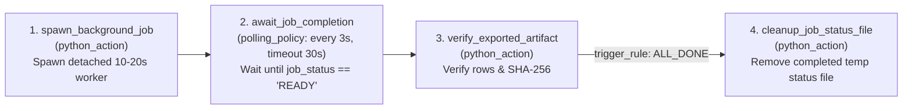

# Example 4: Asynchronous Background Job Watcher (`async_job_watcher`)

Demonstrates **`polling_policy`** (waiting on an external process whose duration
is unknown in advance) and **`trigger_rule: ALL_DONE`** cleanup using a
zero-dependency detached local worker that updates a JSON status file over a
random **10–20 second** window (`25%` $\rightarrow$ `50%` $\rightarrow$ `75%`
$\rightarrow$ `READY`).

## DAG Topology



## Quick Run (10–20s Live Polling)

```bash
# 1. Start workflow and watch polling ticks every 3s until READY (10-20s)
lightflow start --lightflow=examples/async_job_watcher --log_id=poll_01

# 2. Clean up state
lightflow cleanup --log_id=poll_01
```

## Test Polling Timeout Yield + `lightflow resume`

Pass `"timeout_demo": true` (which sets the background worker duration to `40s`,
exceeding the stage's `30s` polling window) to watch Lightflow yield control
back to the operator/agent with a resume command, then run `lightflow resume`
~10 seconds later to finish without re-spawning the background job:

```bash
# 1. Start with a 40s worker -> polling yields after 30s with a resume notice
lightflow start --lightflow=examples/async_job_watcher --log_id=poll_timeout \
  --payload='{"timeout_demo": true}'

# 2. Resume ~10s later -> picks up the finished status file and completes
lightflow resume --lightflow=examples/async_job_watcher --log_id=poll_timeout
```
