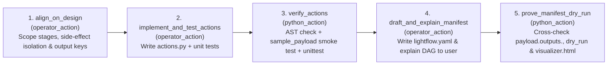

# Example 5: A Lightflow to Create Lightflows (`create_lightflow`)

Why dump a 200-line markdown skill into an AI agent's context window and hope it
doesn't skip unit testing, mismatch stage output keys, or forget `run_after`
dependencies?

This example demonstrates **Staggered Skill Delivery**: using Lightflow to guide
an AI agent (and human operator) through creating a *new* Lightflow workflow
across three gated phases, backed by deterministic Python verification stages
that refuse to advance until the generated code parses, returns valid
JSON-serializable `(dict, str)` tuples, passes unit tests, and cross-checks
every `payload.outputs.<stage>` reference against the DAG's `run_after` graph.

## DAG Topology



*Note*: If `payload.outputs.align_on_design.has_python_actions == false` (an
operator-only workflow), stages 2 and 3 are automatically marked `SKIPPED` and
execution jumps straight from `align_on_design` to `draft_and_explain_manifest`.

--------------------------------------------------------------------------------

## Try It Step-by-Step

### 0. Dry-Run the Meta-Workflow

```bash
lightflow dry_run --lightflow=examples/create_lightflow/lightflow.yaml
```

### 1. Start the Workflow (Pauses at Step 1: `align_on_design`)

```bash
lightflow start --lightflow=examples/create_lightflow/lightflow.yaml --log_id=demo_scaffold
```

Lightflow exits with code `2` (`SUSPENDED`) and prompts the agent to align with
the user on stage boundaries and output keys.

### 2. Resolve Step 1 (`align_on_design`)

Suppose you and the agent agree to build a new workflow `hello_billing` in
`/tmp/hello_billing` with one Python action `calculate_invoice`:

```bash
mkdir -p /tmp/hello_billing

lightflow resume --lightflow=examples/create_lightflow/lightflow.yaml \
  --log_id=demo_scaffold \
  --stage=align_on_design \
  --resolution=APPROVE \
  --payload='{"target_dir": "/tmp/hello_billing", "workflow_name": "hello_billing", "summary": "Calculate invoice total and pause for approval", "has_python_actions": true, "action_names": ["calculate_invoice"]}'
```

Lightflow advances and suspends at **Step 2 (`implement_and_test_actions`)**.

### 3. Write `actions.py` & Resolve Step 2 (`implement_and_test_actions`)

Create `/tmp/hello_billing/actions.py` and resolve the gate with a
`sample_payload` so `verify_actions` smoke-tests the return contract:

```bash
cat << 'EOF' > /tmp/hello_billing/actions.py
from typing import Any

def calculate_invoice(payload: dict[str, Any], **kwargs: Any) -> tuple[dict[str, Any], str]:
    items = payload.get("items", [120, 80])
    total = sum(items)
    return {"invoice_total": total}, f"Calculated invoice total ${total}"
EOF

lightflow resume --lightflow=examples/create_lightflow/lightflow.yaml \
  --log_id=demo_scaffold \
  --stage=implement_and_test_actions \
  --resolution=APPROVE \
  --payload='{"actions_file": "actions.py", "sample_payload": {"items": [120, 80]}}'
```

Lightflow automatically executes **`verify_actions`** (parsing
`/tmp/hello_billing/actions.py`, invoking `calculate_invoice` against
`sample_payload` to confirm it returns a JSON-serializable `(dict, str)` tuple)
and suspends at **Step 3 (`draft_and_explain_manifest`)**.

### 4. Write `lightflow.yaml` & Resolve Step 3 (`draft_and_explain_manifest`)

```bash
cat << 'EOF' > /tmp/hello_billing/lightflow.yaml
name: hello_billing
description: Calculate invoice total and pause for CFO approval.

actions:
  - id: calculate_invoice
    python_import: actions.calculate_invoice

stages:
  - name: compute
    description: Compute invoice total
    python_action:
      action_id: calculate_invoice

  - name: approve_invoice
    description: Manager sign-off
    run_after:
      - compute
    operator_action:
      instructions: "'Approve invoice for $' + string(payload.outputs.compute.invoice_total) + '?'"
      json_schema: '{"type": "object", "required": ["approved"]}'
EOF

lightflow resume --lightflow=examples/create_lightflow/lightflow.yaml \
  --log_id=demo_scaffold \
  --stage=draft_and_explain_manifest \
  --resolution=APPROVE \
  --payload='{"manifest_file": "lightflow.yaml", "explained_to_user": true}'
```

Lightflow runs **`prove_manifest_dry_run`**, compiles
`/tmp/hello_billing/lightflow.yaml`, verifies that `payload.outputs.compute` is
an upstream dependency in `run_after`, verifies `actions.calculate_invoice` is
importable, runs `dry_run`, generates `/tmp/hello_billing/visualizer.html`, and
completes the workflow!
