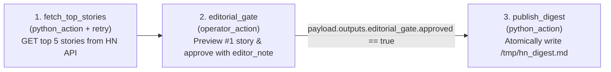

# Example 1: Hacker News Live Curate & Digest (`hn_digest`)

Demonstrates a `python_action` $\rightarrow$ `operator_action` $\rightarrow$
`python_action` pipeline tapping the official, zero-auth **Hacker News Firebase
API** (`https://hacker-news.firebaseio.com/v0/topstories.json`).

## DAG Topology



## Quick Run

```bash
# 1. Start workflow - fetches live HN stories and suspends at 'editorial_gate' (exit code 2)
lightflow start --lightflow=examples/hn_digest --log_id=hn_run_01

# 2. Approve the gate and attach your editorial commentary
lightflow resume --lightflow=examples/hn_digest \
  --log_id=hn_run_01 \
  --stage=editorial_gate \
  --resolution=APPROVE \
  --payload='{"editor_note": "Strong systems & AI tooling threads today.", "output_path": "/tmp/hn_digest.md"}'

# 3. Inspect the generated Markdown digest
cat /tmp/hn_digest.md
```
