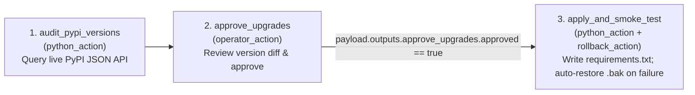

# Example 3: PyPI Dependency Audit, Approval & Automatic Rollback (`pypi_upgrade_guard`)

Demonstrates a live `python_action` $\rightarrow$ `operator_action`
$\rightarrow$ `python_action` + **`rollback_action`** pipeline using the
zero-auth **PyPI JSON API** (`https://pypi.org/pypi/<package>/json`).

## DAG Topology



## Quick Run (Success Path)

```bash
# 1. Audit PyPI and pause at 'approve_upgrades'
lightflow start --lightflow=examples/pypi_upgrade_guard/lightflow.yaml --log_id=pypi_01

# 2. Approve upgrade
lightflow resume --lightflow=examples/pypi_upgrade_guard/lightflow.yaml \
  --log_id=pypi_01 \
  --stage=approve_upgrades \
  --resolution=APPROVE \
  --payload='{"requirements_path": "/tmp/demo_requirements.txt"}'
```

## Test Automatic Rollback + Selective Subgraph Re-Arming

Pass `"simulate_smoke_failure": true` when approving the gate to see
`rollback_action` (`restore_requirements_backup`) automatically revert
`/tmp/demo_requirements.txt` to the original pinned versions, then re-arm only
the failed stage with `"simulate_smoke_failure": false`:

```bash
# 1. Approve with simulated smoke failure -> triggers rollback_action & exits 1
lightflow resume --lightflow=examples/pypi_upgrade_guard/lightflow.yaml \
  --log_id=pypi_01 \
  --stage=approve_upgrades \
  --resolution=APPROVE \
  --payload='{"requirements_path": "/tmp/demo_requirements.txt", "simulate_smoke_failure": true}'

# 2. Re-arm the failed stage without re-running audit_pypi_versions or approve_upgrades
lightflow resume --lightflow=examples/pypi_upgrade_guard/lightflow.yaml \
  --log_id=pypi_01 \
  --payload='{"simulate_smoke_failure": false}'
```
