<!-- mdformat global-off -->
# `tenant_gitops_onboarding` — 39-Stage Kubernetes & GitOps Tenant Provisioning

This example demonstrates why **large-scale enterprise platform workflows** belong in a checkpointed Lightflow DAG rather than an ad-hoc prompt or shell script.

Onboarding a new microservice team (`payments-eu`) onto a multi-tenant Kubernetes + GitOps platform requires **39 ordered stages** across **32 action definitions** that interleave:
- **Role-based branching (`run_if`)**: Non-admin requesters file an onboarding ticket and exit cleanly (`stop_non_admin_stage`), while platform admins proceed through full infrastructure actuation.
- **2 Human-in-the-loop gates (`operator_action`, `EXIT_CODE=2`)**:
  1. `verify_spec`: Always pauses before any mutation so the human operator confirms the resolved tenant alias, OIDC group root, administrators, and FinOps cost center.
  2. `prompt_sa_activation`: **Conditionally triggers** (`run_if: "payload.sa_creation_status == 'PERMISSION_DENIED'"`) only when automated workload `ServiceAccount` creation hits a quota/permission boundary, asking the operator to activate `<root>-jobs.svc` in the IAM portal and resume with `{"manually_activated": true}`.
- **3-way conditional fan-out + `ALL_DONE` join**: `wait_sa_activation` uses `trigger_rule: ALL_DONE` after `prompt_sa_activation` so it runs whether the manual portal gate was **skipped** (`sa_creation_status == 'SUCCESS'`) or **completed** (`sa_creation_status == 'PERMISSION_DENIED'`).
- **5 parameterized GitOps PR merge loops**: Reuses a single `check_pr_merged` polling action across 5 separate PR stages via `static_kwargs: {target_pr_key: "..."}` (`rbac_pr_id`, `scaffolding_pr_id`, `cronjob_pr_id`, `wiring_pr_id`, `catalog_pr_id`).
- **6 control-plane reconciler polling loops (`polling_policy`)**: Waits for CAB ticket approval, OIDC config absorption, trusted-issuer activation, SCIM two-way group sync, ServiceAccount readiness, and root mesh absorption.
- **Automatic rollback (`rollback_action` + `retry_policy`)**: `provision_external_resources` provisions the Terraform state bucket and Vault secret mount and automatically invokes `rollback_external_resources` if post-provisioning fails.

All external systems are simulated hermetically against a local JSON state file in a temporary sandbox directory, so all 39 stages run end-to-end in `<1s` with zero cloud credentials.

---

## DAG Topology (39 Stages across 4 Phases)

```mermaid
flowchart TD
  subgraph Phase1["Phase 1: Spec, RBAC Check & Governance (7 stages)"]
    init_spec --> check_admin --> verify_spec{{"⏸️ verify_spec (Gate #1)"}} --> create_ticket
    create_ticket -- "is_admin == true" --> checkpoint_ticket --> wait_governance_approval(["🔄 wait_governance_approval"])
    create_ticket -- "is_admin == false" --> stop_non_admin_stage
  end

  subgraph Phase2["Phase 2: OIDC RBAC PR & Group Actuation (7 stages)"]
    wait_governance_approval --> inject_rbac_manifest --> register_rbac_in_kustomize --> package_rbac_pr
    package_rbac_pr --> wait_rbac_pr_submission(["🔄 wait_rbac_pr_submission"]) --> wait_oidc_absorption(["🔄 wait_oidc_absorption"])
    wait_oidc_absorption --> actuate_identity_groups --> add_admins
  end

  subgraph Phase3["Phase 3: SCIM Sync & ServiceAccount Escalation (9 stages)"]
    add_admins --> propose_trusted_issuer --> wait_trusted_issuer_approval(["🔄 wait_trusted_issuer_approval"])
    wait_trusted_issuer_approval --> enable_automated_management --> trigger_scim_reconciliation --> wait_scim_sync(["🔄 wait_scim_sync"])
    wait_scim_sync --> create_service_account
    create_service_account -- "FAILED" --> fail_on_sa_failed
    create_service_account -- "PERMISSION_DENIED" --> prompt_sa_activation{{"⏸️ prompt_sa_activation (Gate #2)"}}
    prompt_sa_activation -- "ALL_DONE (SUCCESS or PERMISSION_DENIED)" --> wait_sa_activation(["🔄 wait_sa_activation"])
  end

  subgraph Phase4["Phase 4: Cloud Artifacts, K8s Scaffolding, CronJob, Mesh & Catalog PRs (16 stages)"]
    wait_sa_activation --> provision_external_resources["provision_external_resources (retry + rollback)"] --> checkpoint_external_resources
    checkpoint_external_resources --> scaffold_k8s_structure --> package_scaffolding_pr --> wait_scaffolding_pr(["🔄 wait_scaffolding_pr"])
    wait_scaffolding_pr --> bootstrap_cronjob_rbac --> package_cronjob_rbac_pr --> wait_cronjob_pr(["🔄 wait_cronjob_pr"])
    wait_cronjob_pr --> nest_in_root_groups --> package_wiring_pr --> wait_wiring_pr(["🔄 wait_wiring_pr"])
    wait_wiring_pr --> wait_wiring_oidc_absorption(["🔄 wait_wiring_oidc_absorption"]) --> trigger_group_reconciliation
    trigger_group_reconciliation --> propose_cost_center_association --> package_catalog_pr --> wait_catalog_pr(["🔄 wait_catalog_pr"])
  end
```



---

## Running the Example

### 1. Preview all 39 stages with `dry_run`
```bash
lightflow dry_run \
  --lightflow=examples/tenant_gitops_onboarding/lightflow.yaml \
  --log_id=onboard_preview
```

### 2. Run with Conditional Human Quota Escalation (2 Gates: `verify_spec` + `prompt_sa_activation`)
Pass `require_manual_sa_portal: true` to simulate an IAM quota boundary on `create_service_account` so both human gates trigger:

```bash
# Turn 1: Resolves spec and pauses at Gate #1 (verify_spec, EXIT_CODE=2)
lightflow start \
  --lightflow=examples/tenant_gitops_onboarding/lightflow.yaml \
  --log_id=onboard_payments_eu \
  --payload='{"alias": "payments-eu", "require_manual_sa_portal": true}' \
  --force

# Turn 2: Confirm spec -> runs Phases 1-3 (ticket, RBAC PR #101, OIDC groups, SCIM sync)
# and pauses at Gate #2 (prompt_sa_activation, EXIT_CODE=2)
lightflow resume \
  --lightflow=examples/tenant_gitops_onboarding/lightflow.yaml \
  --log_id=onboard_payments_eu \
  --stage=verify_spec \
  --resolution=APPROVE \
  --payload='{"approved": true}'

# Turn 3: Confirm manual ServiceAccount portal activation -> runs Phase 4
# (Terraform/Vault artifacts, K8s PR #102, CronJob PR #103, Mesh PR #104, Catalog PR #105)
lightflow resume \
  --lightflow=examples/tenant_gitops_onboarding/lightflow.yaml \
  --log_id=onboard_payments_eu \
  --stage=prompt_sa_activation \
  --resolution=APPROVE \
  --payload='{"manually_activated": true}'

# Clean up state
lightflow cleanup --log_id=onboard_payments_eu
```
