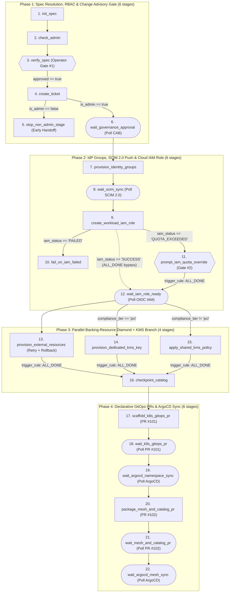

# Enterprise GitOps Tenant Onboarding (`tenant_gitops_onboarding`)

A **22-stage, 4-phase, multi-branch** reference workflow that models how a
cloud-native platform engineering team provisions an isolated Kubernetes tenant
environment end-to-end across **Change Advisory Governance**, **IdP + SCIM 2.0
Group Push**, **Cloud IAM OIDC Workload Identity**, **Parallel Storage &
Compliance-Tiered KMS Encryption**, and **Two-Phase GitOps PR + ArgoCD Sync**.

Every external API, GitOps repository, and cloud control plane is **100% mocked
in a local temporary directory** (`control_plane_state.json` + rendered GitOps
manifests), so the entire 22-stage DAG runs offline in **< 0.15 seconds** with
zero credentials or network calls.

--------------------------------------------------------------------------------

## Why This Example Exists

While `examples/hn_digest` (3 stages) and `examples/pypi_upgrade_guard` (3
stages) introduce single-gate approvals and compensating rollbacks on small
linear pipelines, real-world platform orchestration graphs combine **multiple
branching topologies, conditional human-in-the-loop escalations, parallel
diamond fan-out/fan-in, and stateful polling loops** in a single workflow.

`tenant_gitops_onboarding` showcases **every advanced Lightflow primitive**
using strict stage-scoped output isolation (`payload.outputs.<stage>.<key>`):

1.  **Branching Pattern #1 — Role-Based Early Handoff (Phase 1)**:
    -   Evaluates the caller's RBAC role (`check_admin`), pauses at **Gate #1**
        (`verify_spec`) to confirm the resolved tenant spec, opens a Change
        Advisory Board (CAB) ticket (`create_ticket`), and then branches:
        -   **Non-admin requester** (`payload.outputs.check_admin.is_admin ==
            false`): runs `stop_non_admin_stage` to hand the ticket off to the
            platform queue and cleanly skips all 16 downstream actuation stages.
        -   **Platform admin** (`payload.outputs.check_admin.is_admin == true`):
            skips `stop_non_admin_stage` and polls the CAB ticket in
            `wait_governance_approval`.
2.  **Branching Pattern #2 — 3-Way Status Fan-Out + `ALL_DONE` Convergence
    (Phase 2)**:
    -   After provisioning 3-tier IdP RBAC groups (`admins`, `devs`,
        `workloads`) and polling SCIM 2.0 group push (`wait_scim_sync`),
        `create_workload_iam_role` attempts to create the Cloud IAM OIDC
        Workload Identity Role
        (`arn:aws:iam::123456789012:role/tenant-<alias>-workload`) and returns
        one of three status codes (`iam_status`):
        -   `'FAILED'` $\rightarrow$ triggers `fail_on_iam_failed` (terminal
            error).
        -   `'QUOTA_EXCEEDED'` $\rightarrow$ pauses at **Gate #2**
            (`prompt_iam_quota_override`), requiring a security officer to
            approve the quota override (`{"approved": true,
            "quota_override_approved": true}`, enforced via JSON Schema `const:
            true`).
        -   `'SUCCESS'` $\rightarrow$ skips both `fail_on_iam_failed` and
            `prompt_iam_quota_override`.
    -   `wait_iam_role_ready` uses `trigger_rule: ALL_DONE` together with a
        compound `run_if` guard to converge both the automated `'SUCCESS'` path
        and the approved `'QUOTA_EXCEEDED'` path (while cascading `SKIPPED` if
        Gate #2 is rejected).
3.  **Branching Pattern #3 — Concurrent Backing-Resource Diamond +
    Compliance-Tier KMS Branch (Phase 3)**:
    -   Once `wait_iam_role_ready` completes, the DAG fans out into **three
        concurrent children**:
        -   **Track A (Storage + Vault with Retry & Rollback)**:
            `provision_external_resources` provisions the Terraform state bucket
            (`s3://platform-tfstate-<alias>`) and Vault KV mount
            (`secret/tenants/<alias>`), protected by `retry_policy`
            (`max_attempts: 2`) and `rollback_action:
            rollback_external_resources`.
        -   **Track B1 (Dedicated HSM CMK for PCI Tier)**:
            `provision_dedicated_kms_key` runs only when
            `payload.outputs.init_spec.compliance_tier == 'pci'`.
        -   **Track B2 (Shared Multi-Tenant KMS Policy for Non-PCI Tiers)**:
            `apply_shared_kms_policy` runs only when
            `payload.outputs.init_spec.compliance_tier != 'pci'`.
    -   `checkpoint_catalog` joins all three upstream tracks via `trigger_rule:
        ALL_DONE`, verifies that both Storage and whichever KMS branch executed
        succeeded, and checkpoints the consolidated coordinates into
        `control_plane_state.json` before Phase 4 commits
        `gitops/catalog/tenants/<alias>.yaml`.
4.  **Two-Phase Declarative GitOps PRs & ArgoCD Sync Polling (Phase 4)**:
    -   Opens two sequential GitOps Pull Requests with real state transitions
        (`OPEN` $\rightarrow$ `MERGED` in `control_plane_state.json`) and polls
        ArgoCD application health (`OutOfSync` $\rightarrow$ `Synced` /
        `Healthy`):
        -   **PR #101 (`scaffold_k8s_gitops_pr` $\rightarrow$
            `wait_k8s_gitops_pr` $\rightarrow$ `wait_argocd_namespace_sync`)**:
            Kubernetes `Namespace` (with Pod Security Standards `restricted`),
            3-tier RBAC `RoleBinding`s, OIDC-annotated `ServiceAccount`,
            zero-trust `NetworkPolicy`, and KMS-backed `ExternalSecret`.
        -   **PR #102 (`package_mesh_and_catalog_pr` $\rightarrow$
            `wait_mesh_and_catalog_pr` $\rightarrow$ `wait_argocd_mesh_sync`)**:
            Gateway API `HTTPRoute`, Prometheus `ServiceMonitor`, and FinOps
            chargeback catalog registration.

--------------------------------------------------------------------------------

## DAG Architecture (22 Stages Across 4 Phases)



--------------------------------------------------------------------------------

## Quickstart: Run All 5 Execution Paths

### 1. Preview the 22-Stage Execution Plan (`dry_run`)

```bash
lightflow dry_run --lightflow=examples/tenant_gitops_onboarding
```

### 2. Full 2-Gate PCI Compliance Path (`require_manual_quota_override: true`)

```bash
# Step 1: Start - runs init_spec & check_admin, then pauses at Gate #1 (verify_spec)
lightflow start \
  --lightflow=examples/tenant_gitops_onboarding \
  --log_id=tenant_pci_demo \
  --payload='{"alias": "payments-eu", "compliance_tier": "pci", "require_manual_quota_override": true}' \
  --force

# Step 2: Approve Gate #1 - runs Phase 1 & Phase 2, then pauses at Gate #2 (prompt_iam_quota_override)
lightflow resume \
  --lightflow=examples/tenant_gitops_onboarding \
  --log_id=tenant_pci_demo \
  --stage=verify_spec \
  --resolution=APPROVE \
  --payload='{"approved": true}'

# Step 3: Approve Gate #2 - provisions dedicated PCI KMS key in parallel with S3/Vault,
#         checkpoints the catalog, merges GitOps PRs #101 & #102, and syncs ArgoCD
lightflow resume \
  --lightflow=examples/tenant_gitops_onboarding \
  --log_id=tenant_pci_demo \
  --stage=prompt_iam_quota_override \
  --resolution=APPROVE \
  --payload='{"approved": true, "quota_override_approved": true}'
```

### 3. Standard Compliance Tier + Automated IAM Path (`ALL_DONE` Bypass + Shared KMS Branch)

```bash
# Starts with compliance_tier="standard" and automated IAM creation (iam_status="SUCCESS").
# Skips Gate #2 (prompt_iam_quota_override), skips provision_dedicated_kms_key,
# executes apply_shared_kms_policy in parallel with provision_external_resources,
# and joins at checkpoint_catalog.
lightflow start \
  --lightflow=examples/tenant_gitops_onboarding \
  --log_id=tenant_std_demo \
  --payload='{"alias": "analytics-us", "compliance_tier": "standard"}' \
  --force

lightflow resume \
  --lightflow=examples/tenant_gitops_onboarding \
  --log_id=tenant_std_demo \
  --stage=verify_spec \
  --resolution=APPROVE \
  --payload='{"approved": true}'
```

### 4. Simulated Storage Failure $\rightarrow$ Compensating Rollback $\rightarrow$ Surgical Resume

```bash
# Inject a transient Vault/storage failure in Phase 3 (provision_external_resources)
lightflow start \
  --lightflow=examples/tenant_gitops_onboarding \
  --log_id=tenant_rollback_demo \
  --payload='{"alias": "payments-eu", "simulate_artifact_failure": true}' \
  --force

# Approving Gate #1 runs through Phase 2, retries provision_external_resources twice,
# runs rollback_external_resources to clean up partial artifacts, and stops before Phase 4
lightflow resume \
  --lightflow=examples/tenant_gitops_onboarding \
  --log_id=tenant_rollback_demo \
  --stage=verify_spec \
  --resolution=APPROVE \
  --payload='{"approved": true}'

# Surgically resume ONLY from provision_external_resources - Phases 1-2 and the parallel
# KMS key stage remain COMPLETED and are not re-executed!
lightflow resume \
  --lightflow=examples/tenant_gitops_onboarding \
  --log_id=tenant_rollback_demo \
  --stage=provision_external_resources \
  --payload='{"simulate_artifact_failure": false}'
```

### 5. Non-Admin Early Handoff Path (`simulate_non_admin: true`)

```bash
# Non-admin requester opens the Change Advisory ticket and exits cleanly via stop_non_admin_stage
lightflow start \
  --lightflow=examples/tenant_gitops_onboarding \
  --log_id=tenant_non_admin_demo \
  --payload='{"alias": "payments-eu", "simulate_non_admin": true}' \
  --force

lightflow resume \
  --lightflow=examples/tenant_gitops_onboarding \
  --log_id=tenant_non_admin_demo \
  --stage=verify_spec \
  --resolution=APPROVE \
  --payload='{"approved": true}'
```
