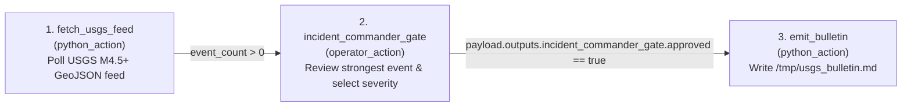

# Example 2: USGS Global Earthquake Triage & Bulletin (`usgs_seismic_alert`)

Demonstrates a live telemetry `python_action` $\rightarrow$ `operator_action`
$\rightarrow$ `python_action` pipeline tapping the official, zero-auth **USGS
M4.5+ GeoJSON Feed**
(`https://earthquake.usgs.gov/earthquakes/feed/v1.0/summary/4.5_day.geojson`).

## DAG Topology



## Quick Run

```bash
# 1. Poll live USGS feed and pause at 'incident_commander_gate'
lightflow start --lightflow=examples/usgs_seismic_alert/lightflow.yaml --log_id=usgs_01

# 2. Approve and classify severity
lightflow resume --lightflow=examples/usgs_seismic_alert/lightflow.yaml \
  --log_id=usgs_01 \
  --stage=incident_commander_gate \
  --resolution=APPROVE \
  --payload='{"severity": "ADVISORY"}'

# 3. View the bulletin
cat /tmp/usgs_bulletin.md
```
